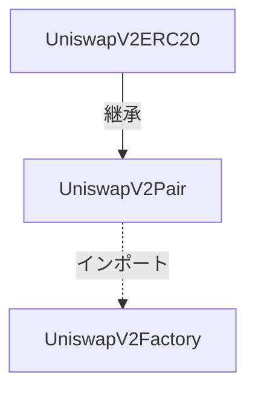
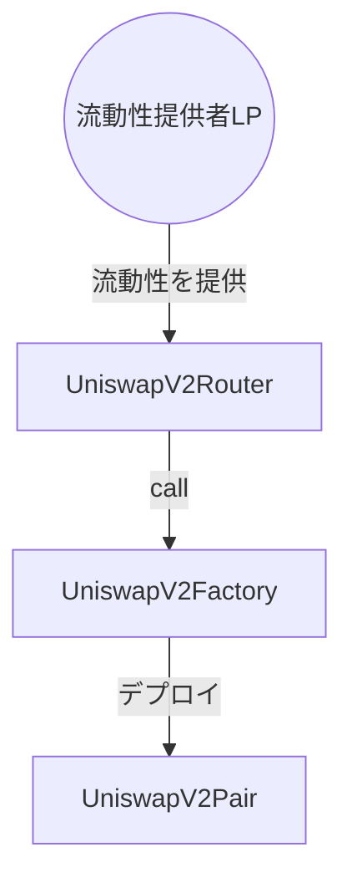
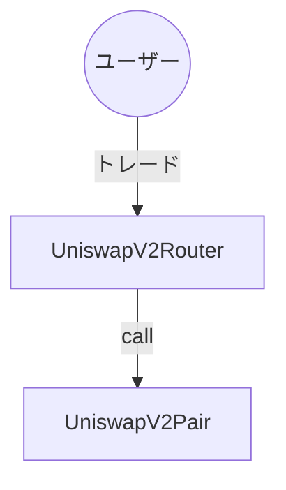

# Uniswap V2 日本語解説
主な構成：

- [ファクトリコントラクト](./UniswapV2Factory.md)

- [ペアコントラクト](./UniswapV2Pair.md)

- [ルーターコントラクト](./UniswapV2Router02.md)

# コントラクトの関係図

## 流動性追加(Provide Liquidity)

## スワップ(Swap)

# Mechanism

1. Uniswapのコアコントラクトは3つのコントラクト、すなわちファクトリーコントラクト、ペアコントラクト、ERC20コントラクトに分けられます。
2. コアコントラクトのデプロイ時には、ファクトリーコントラクトのみをデプロイする必要があります。
3. ファクトリーコントラクトのデプロイ時には、コンストラクタに手数料送付先のみを設定します。
4. ファクトリーコントラクトがデプロイされた後、ファクトリーコントラクトを通じて、ペアコントラクトの作成を行うことができます。
5. Uniswapで取引を行うためには、操作の順序は次のとおりです:取引ペアコントラクトの作成、流動性の追加、スワップ。
6. ペアを追加する際には、二つのトークンのアドレスを提供する必要があり、その後、ファクトリーコントラクトはこの取引ペアに対して新しいペアコントラクトをデプロイします。
7. ペアコントラクトのデプロイはcreate2の方法で行われます。
8. 二つのトークンアドレスは2進数の大きさでソートされ、その後ハッシュされ、このハッシュ値がcreate2のsaltとして使用されてデプロイされます。
9.  そのため、ペアコントラクトのアドレスは、二つのトークンアドレスを用いてcreate2を計算することで求めることができます。
10. 流動性提供者は二つのトークンをペアコントラクトに預け入れることができ、その後、ペアコントラクトは流動性提供者のためにERC20互換のトークンを流動性トークンとして生成します。
11. ペアコントラクトで生成されたerc20トークンは流動性トークンになります。
12. 流動性のトークンはerc20の操作を行うことができ、他のユーザーに流動性トークンを送信することができます。
13. ユーザーは流動性を取り出すこともでき、ペアコントラクトは流動性トークンをburnし、流動性として入れた2種類のトークンをユーザーに返還します。
14. 返還される数量は、流動性の数量と二つのトークンの準備量に基づいて再計算され、手数料の利益がある場合、ユーザーはその利益を得ることができます。
15. ユーザーは一つのトークンを使って別のトークンを交換することができ、ペアコントラクトは0.3%の手数料をもらってユーザーにトークンを返します（手数料が設定された場合に、0.05%はプロトコル手数料として徴収）。
16. Uniswapのコアコントラクトの上には、より良いインターフェースのためのルートコントラクトが存在します。
17. ルートコントラクトは3つの操作方法を持っています。すなわち、流動性の追加、流動性の除去、交換。
18. ペアコントラクトがすべての取引操作を完了することができますが、ルートコントラクトはすべての操作を統合し、フロントエンドと連携して取引をより効率的に行うことができます。一般ユーザーは基本的にはルートコントラクトを通してUniswapとインタラクションを取ります。

# Uiswap Interface

## 自前のDEXをデプロイする手順

- [Uniswapをデプロイする手順](./Deploy.md)
